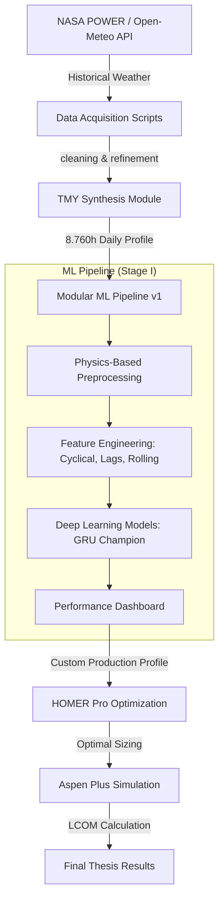

# ☀️ Modular Solar PV Forecasting Pipeline (v1)

[](https://www.python.org/downloads/)

An end-to-end deep learning framework designed for high-fidelity Photovoltaic (PV) power output forecasting. This project was developed as part of an **Undergraduate Thesis (Skripsi)** supervised by **Universitas Indonesia / Your University** to drive the **Power-to-Methanol** energy transition in East Nusa Tenggara (NTT), Indonesia.

> [!IMPORTANT]
> This pipeline serves as **Stage I** of a "Sequential Hybrid Optimization" framework: 
> **AI Forecasting (Stage I)** → **HOMER Pro Sizing (Stage II)** → **Aspen Plus Process Simulation (Stage III)**.

---

## 🚀 Key Highlights & Achievements

*   **Benchmarked SOTA Architectures**: Implemented and evaluated **PatchTST, Autoformer, GRU, LSTM**, and **SimpleRNN**.
*   **Identified GRU as Champion**: GRU was found to be the most robust for 24-hour ahead temporal prediction in tropical climates, achieving a deterministic performance of **nRMSE 8.4%** and **nMAE 4.4%**.
*   **Physics-Driven Preprocessing**: Implements a rigorous cleaning algorithm (Algorithm 1) that cross-validates GHI, DHI, and PV consistency.
*   **TMY Synthesis Engine**: Includes specialized scripts to generate Typical Meteorological Year (TMY) profiles for 8,760-hour industrial simulations.

---

## 🛠️ System Architecture



---

## 📦 Features

- **9 Model Architectures** — PatchTST, Autoformer, GRU, LSTM, etc.
- **HuggingFace Integration** — Access 🤗 Transformers via PyTorch wrappers.
- **Physics-Infused Features** — Clear Sky Index (CSI), Solar Position, and Physical Parameter Clamping.
- **Interactive Dashboard** — Full Streamlit interface for training monitoring and dataset insights.
- **Optimization** — Bayesian hyperparameter tuning via Optuna.
- **Industrial Export** — Automated generation of `Custom Production Profiles` for HOMER Pro.

---

## 📂 Project Structure

```bash
├── app.py                    # Streamlit Dashboard (Main UI)
├── scripts/                  # Data Acquisition & Utility Scripts
│   ├── fetch_nasa_power_ntt.py  # Historical weather collector
│   ├── build_tmy_ntt.py        # TMY synthesis engine
│   └── run_batch_train.py      # Automated experiment runner
├── src/                      # Core Logic
│   ├── data_prep.py          # Algorithm 1: Physics-based cleaning
│   ├── model_factory.py      # Keras/TensorFlow implementations
│   ├── model_hf.py           # PyTorch/HuggingFace wrappers
│   └── predictor.py          # Evaluation & Prediction logic
├── config.yaml               # Central configuration file
├── otomatisasi_workflow.md    # Agent automation instructions
└── requirements.txt          # Environment dependencies
```

---

## 🚦 Quick Start

### 1. Environment Setup
```bash
conda create -n solar python=3.10
conda activate solar
pip install -r requirements.txt
```

### 2. Data Acquisition
Collect historical weather for your target location:
```bash
python scripts/fetch_nasa_power_ntt.py
```

### 3. Launch the Hub
```bash
streamlit run app.py
```

---

## 🎓 Academic Thesis Context
This project implements the methodology proposed in my thesis:
**"Comparative Study of Power-to-Methanol System Configurations: Techno-Economic Analysis Based on Topology Variations and Grid Connection (On-Grid vs Off-Grid)"**.

### Acknowledgments
*   **Location**: NTT, Indonesia (Target Site)
*   **Goal**: Decarbonizing the chemical industry through sequential AI-Optimized systems.

---

## 📄 License
Distributed under the MIT License. See `LICENSE` for more information.

---
*Created and maintained with love for the Energy Transition.*
